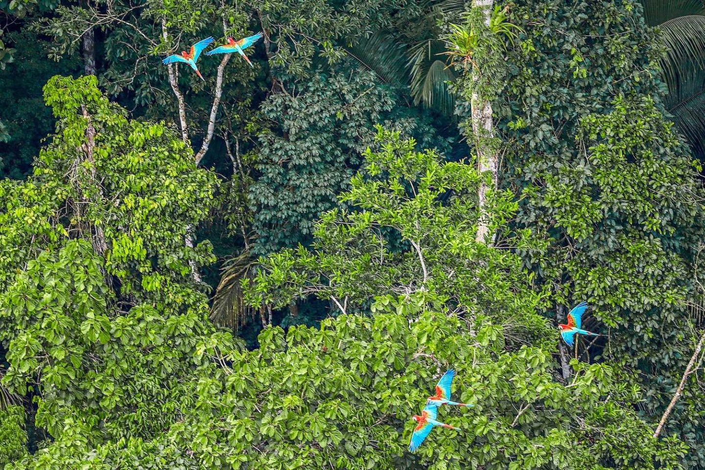

# Texture Synthesis and Object Removal

## Overview

The **Texture Synthesis and Object Removal** project is a Python application that leverages advanced image processing techniques using OpenCV and NumPy. This project consists of two main functionalities:

1. **Texture Synthesis**: Extend a given texture image to create a larger, seamless texture.
2. **Object Removal**: Remove unwanted objects from images by utilizing texture synthesis.

## Features

- **Texture Synthesis**: 
   - Takes an input texture image and generates an extended texture image.
   - Produces output named `texture-synthesized.jpg`.

- **Object Removal**:
   - Removes specified objects (e.g., birds from a jungle scene, swimmers from a sea scene).
   - Utilizes the texture synthesis technique to fill in the gaps left by removed objects.
   - Produces outputs named `bird-removed.jpg` and `swimmer-removed.jpg`.

## Getting Started

### Prerequisites

Before running the project, ensure you have Python 3 installed along with the required packages. You can install the necessary packages using the provided `requirements.txt` file.

### Installation

1. Clone this repository:

> git clone https://github.com/therealmav/texture-synthesis.git

cd texture-synthesis

2. Set up a virtual environment (optional but recommended):

> python3 -m venv venv

> source venv/bin/activate # On Windows use venv\Scripts\activate

3. Install required packages:

> pip install -r requirements.txt

### Running the Project

To run the project, execute the following command:

> python3 -m src

This command will trigger both the texture synthesis and object removal processes, generating results in the `results` directory.

## Example Results

### Texture Synthesis Output

### Object Removal Outputs

*Example of object removal input: jungle.jpg*

*Example of object removal output: birds-removed.jpg*

*Example of object removal output: sea.jpg*

*Example of object removal output: swimmer-removed.jpg*

## Resources

The input images used for processing can be found in the `resources` directory. Ensure you have appropriate images to achieve desired results.

## Acknowledgements

- OpenCV: For powerful image processing capabilities.
- NumPy: For efficient numerical operations.
